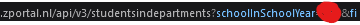

# Zermelo Utils
Zermelo Utils is a project of mine with utils for the zermelo api. \
You are able to get a database of all students at your school, if your school uses zermelo and your permissions are set the same as mine. This is because I am enrolled in only 1 school and don't know how permissions are managed at other schools. \
The configured fields are all field I have permissions for to get at my school. I will add a way later to customise it. \
This tool may be seen as a stalker tool, this is not my intention, it's intention is for me to learn python and just expiriment.
## How use
To use this tool you need to place a .env file in the root directory of the project containing this:
```
SCHOOL=YourSchoolName
SCHOOLYEAR=schoolInSchoolYear
AUTHORIZATION=Bearer YourApiToken
```
- `SCHOOL`, the school name, you can find this by going to your zportal and look at the domain: \
 \
<span style="font-size:0.75em;">(I edited the image, so this is not actually how long my url is)</span> \
Copy the text under the black (Without the slashes at the left) and replace `YourSchoolName` with it
- `SCHOOLYEAR`, a value internally used by zermelo, this will later be replaced, but in the mean time go to zportal and look in devtools at some requests, look for one that contains the following: \
 \
Copy the integer under the red spot and replace `schoolInSchoolYear` with it.
- `AUTHORIZATION`, your api token (this will become invalid in less than 1 day) find it the same way as the last one, but instead look at the request headers for `Authorization`
## File structure
After using the program in the right way your file structure should look something like this:
```
.
├── .git/
│   └── .
├── Images/
│   └── .
├── .env
├── .gitignore
├── leerlingen.db
├── leerlingen.json
├── leerlingen.py
├── message.json
├── README.md
└── zermeloImport.py
```